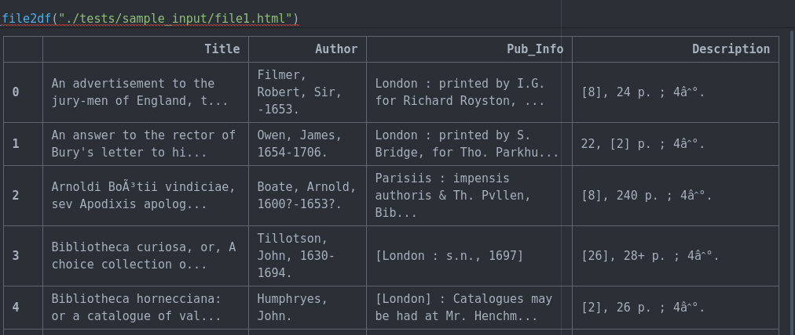

.. image:: https://travis-ci.com/parisac/estc-parser.svg?branch=master
    :target: https://travis-ci.com/parisac/estc-parser

Welcome to estc-parser
######################

| This project was created to help academics and researchers more easily harvest book meta-data from the
|    `British Library English Short Title Catalogue "ESTC" <http://estc.bl.uk/F/QK6AUB9LGJYDXNE3FBT5KCHIDLR7KN7UTPFJKUCVH11FSCBCGQ-00698?func=file&file_name=find-b&local_base=BLL06>`_
|
| Currently if a researcher queries the short title catalog for a specific term, all results are only exportable as an *unstructured .html* file without table tags present. This project aims to simply an otherwise manual workflow by allowing the researcher to convert .html extracts into an *actionable* tabular .csv format.

Quickstart
----------
Supports Python >= 3.7.0

1). Place raw .html extract(s) in ./input_html
2a). **Poetry Usage **

If you have poetry installed on your system, estc-parser can be installed via `Poetry
<https://python-poetry.org/>`_,

.. code-block:: console

    $ cd estc-parser
    $ poetry install
    $ poetry run chewfiles

2b). For a vanilla Python install
.. code-block:: console

    $ cd estc-parser
    $ pip install -r requirements.txt
    $ python3 estc_parser/cli.py

3). Find .csv file with tabular results in ./ouput

Example Query
*************
After submitting a query a researcher can export results using the Email/print/save button highlighted below.

.. image:: ./static/chair.png
    :width: 200pt
    :height: 100pt

Example Raw Export
******************
Here is a sample of the raw unstructured .html export from our estc query.

.. image:: ./static/estc_raw.png
    :width: 200pt
    :height: 100pt

Transformed .csv Export via estc-parser
***************************************
Here we see the output of running the unstructured html above through estc-parser.

