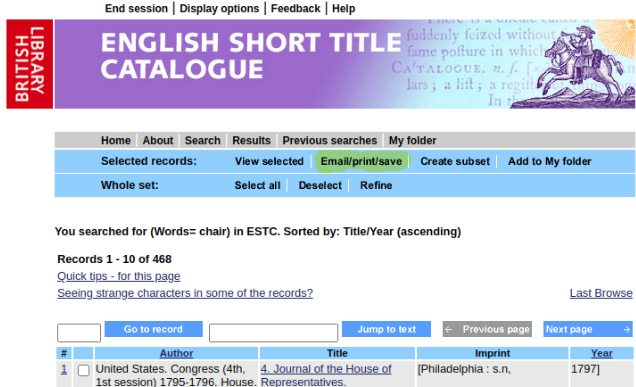

.. image:: https://travis-ci.com/parisac/estc-parser.svg?branch=master
    :target: https://travis-ci.com/parisac/estc-parser

Welcome to estc-parser
######################

| This project was created to help academics and researchers more easily harvest book meta-data from the
|    `British Library English Short Title Catalogue "ESTC" <http://estc.bl.uk/F/QK6AUB9LGJYDXNE3FBT5KCHIDLR7KN7UTPFJKUCVH11FSCBCGQ-00698?func=file&file_name=find-b&local_base=BLL06>`_
|
| Currently if a researcher queries the short title catalog for a specific term, all results are only exportable as an **unstructured .html** file without table tags present :(.
| This project aims to simply an otherwise manual workflow by allowing the researcher to convert .html extracts into *actionable .csv*

Example Query
*************

After submitting a query a researcher can export results using the Email/print/save button highlighted below.

Example Raw Export
******************

Here is a sample of the raw unstructured html exports of a estc query

.. image:: ./static/estc_raw.png
    :width: 200pt
    :height: 100pt
